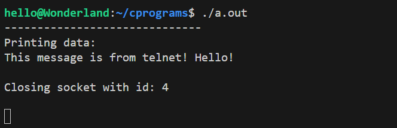
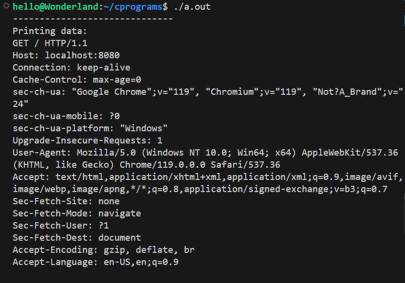

# Basic server in C

This is an example of a very basic server code written in C. The idea of this project is to demistify the hidden components behind the most used web servers these days.

Steps to run this program:
1. Make sure that a compatible C compiler is installed. I used gcc from https://gcc.gnu.org/.
2. Compile using `gcc socket_example.c`
3. Run the compiled output using `./a.out`

 
The following are some example requests received by this server:

1. Request made via telnet: `telnet localhost 8080`

2. Request made via chrome browser (HTTP GET request): `http://localhost:8080`

As we can see from these examples, this program is a bare minimum of a server listening for any request made to localhost on port 8080.